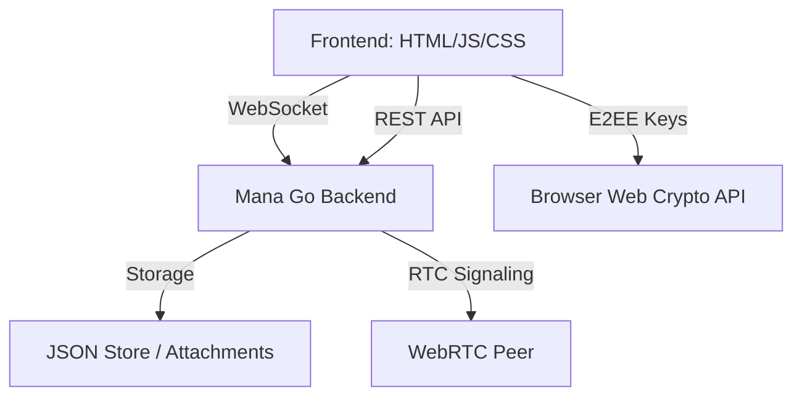

# Kuruvi - Open Source WhatsApp Alternative

**Kuruvi** (meaning "Sparrow") is a high-performance, premium real-time messaging application built on the [Mana](https://github.com/Aswanidev-vs/Mana) framework.


## Features

- **End-to-End Encryption (E2EE)**: Implementation of X25519 (ECDH) for key exchange and AES-GCM for message payload encryption.
- **Real-time Messaging**: sub-100ms message delivery via WebSockets.
- **Voice & Video Calling**: High-quality WebRTC signaling through SFU integration.
- **Presence & Tracking**: Real-time online/offline status and typing indicators.
- **Premium UI**: Modern dark mode with glassmorphism, Inter typography, and smooth micro-animations.
- **JWT Authentication**: Secure stateless authentication for users.
- **Local Persistence**: Durable message storage using Mana's efficient JSON store.

## Architecture



## Setup & Running

### Prerequisites
- Go 1.25 or higher
- Modern web browser (Chrome 87+, Firefox 113+, Safari 15+)

### Installation
1. Clone the repository:
   ```bash
   git clone https://github.com/yourusername/kuruvi.git
   cd kuruvi
   ```

2. Setup dependencies:
   ```bash
   cd backend
   go mod download
   ```

3. Run the application:
   ```bash
   go run main.go
   ```

4. Access the app at `http://localhost:8080`.

## Tech Stack
- **Backend**: Go with Mana Framework.
- **Frontend**: Vanilla JavaScript, HTML5, CSS3 (Glassmorphism).
- **Security**: JWT, Web Crypto API (X25519, AES).
- **Communication**: WebSockets, WebRTC.

## Contributing
Contributions are welcome! Please feel free to submit a Pull Request.

## License
MIT
